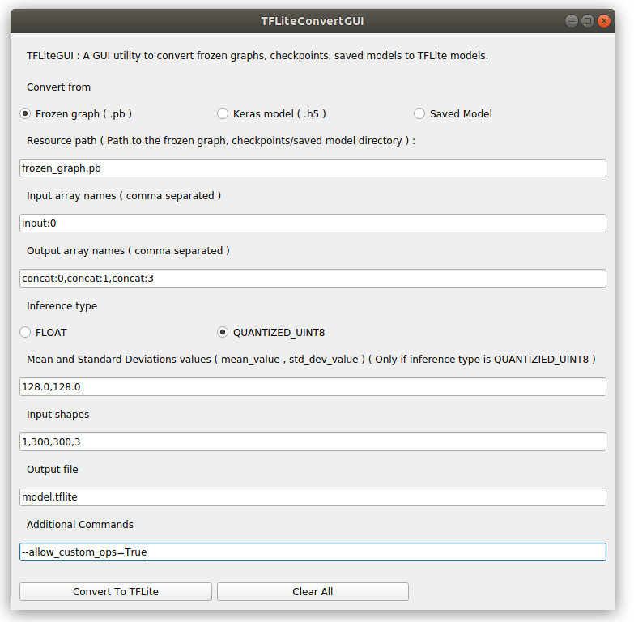

#TFLiteConvertGUI

A simple GUI utility to convert frozen graphs, Keras models and 
SavedModels to TensorFlow Lite format.

> This was a personal app I built for myself to save time which 
> goes in typing long commands!



## Installation

TFLiteConvertGUI is currently tested on Ubuntu 18.04 with Python 
3.7 and TensorFlow 1.15.0.
We need to install `guietta` with which the GUI works.

### For PIP

```
pip install guietta tensorflow==1.15.0
```
That should be enough for PIP users.

### For Conda

First, we need to install `pyside2` for `guietta`,

```
conda install -c conda-forge pyside2
```

And then install `guietta` via PIP,

```
$ pip install guietta
```

Install TensorFlow ( v1.15.0 ) if not installed,

```
$ conda install tensorflow=1.15.0
```

> You may use `tensorflow` or `tensorflow-gpu` as required. We'll
> only require the `tflite_convert` script that comes with both 
> the distributions.

## Usage

After you've install guietta, simply clone this repository and 
run `main.py`.

```
$ git clone shubham0204/TFLiteConvertGUI
```

```
$ python main.py
```

**Note ( For Conda users )**: Make sure you activate the enviroment ( in which you've 
installed `guietta` ) with `conda activate <env_name>`

The app will pop up and then you are ready to use TFLiteConvertGUI. The terminal, 
on clicking *"Convert To TFLite"* will run the `tflite_convert` 
command which you can see in the terminal too.

```
$ python main.py
--> After clicking Convert To TFLite
$ TFLiteConvertGUICommand tflite_convert --graph_def_file=frozen_graph.pb --output_file=model.tflite --input_arrays=input0 --output_arrays=output0 --inference_type=FLOAT --input_shapes=1,448,640,3
```


## Issues and Contributions

Make sure you open an issue if you find any bugs or 
difficulties in the installation process. For feature requests,
 open a pull request.


